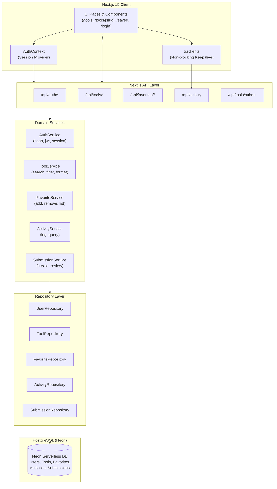

# AI Orbit — Frontier AI Tools Directory & Platform

[](https://nextjs.org/)
[](https://www.typescriptlang.org/)
[](https://www.prisma.io/)
[](https://neon.tech/)
[](https://tailwindcss.com/)

An end-to-end, full-stack **AI Tools Directory** built to match the sleek, dark aesthetic of [AI Orbit](https://aiorbit.club/). Features real-time server-side filtering, debounced search, category navigation, deep tool profiles, JWT authentication with HTTP-only cookies, protected user libraries, community tool submissions, and an automatic user activity tracking engine.

---

## 🛠 Tech Stack

| Layer | Technology | Description |
|---|---|---|
| **Framework** | **Next.js 15 (App Router)** | Hybrid Server & Client Component architecture |
| **Language** | **TypeScript** | Strict end-to-end type safety |
| **Styling** | **Tailwind CSS** | AI Orbit custom dark theme (`#000000`, `#131316`, `#232326`, `#6E56CF`) |
| **Icons** | **Lucide React** | Clean, lightweight modern icons |
| **Database** | **PostgreSQL (Neon Serverless)** | Cloud relational database with connection pooling |
| **ORM** | **Prisma 6** | Schema modeling, typed migrations, and query generation |
| **Authentication** | **JWT + HTTP-Only Cookies** | Secure stateless authentication (`ai_orbit_token`) |
| **Security** | **bcryptjs** | Salted password hashing (10 rounds) |
| **Validation** | **Zod** | Schema validation for auth, query params, favorites, submissions |
| **Testing** | **Playwright** | Headless end-to-end browser verification and screenshots |

---

## 🔄 System Architecture & Workflow



---

## 🌟 Core Features & User Workflows

### 1. AI Tools Discovery
- **Multi-Attribute Filtering**: Filter simultaneously by Category (Coding, Design, Productivity, etc.), Pricing Model (Free, Freemium, Paid), and Supported Platforms (Web, macOS, Windows, Linux).
- **Debounced Server Search**: High-performance search across tool names, taglines, long descriptions, tags, and categories.
- **Sorting Options**: Sort by Popularity, Rating, Newest, or Alphabetical (A-Z).
- **Server-Side Pagination**: Clean page-based pagination with total results calculation.

### 2. Comprehensive Tool Profiles (`/tools/[slug]`)
- Dynamic SEO title, description, and OpenGraph social metadata per tool.
- Verified status badges, ratings, and review counts.
- Structured breakdown of features, ideal use cases, supported platforms, and pricing tiers.
- Interactive **Visit Website** outbound button and **Share Link** clipboard utility.
- Smart related tools recommendation engine based on category similarity.

### 3. Authentication & Sessions
- **Sign Up (`/signup`)**: Form validation via Zod, email uniqueness enforcement, bcrypt password hashing.
- **Sign In (`/login`)**: Credential check, issuing signed 7-day JWT inside an HTTP-only secure cookie (`ai_orbit_token`).
- **Demo Autofill**: 1-click button to autofill verified demo credentials for quick testing.
- **Dynamic Navigation Header**: Updates instantly between unauthenticated actions (Sign In / Sign Up) and authenticated controls (Saved Library, User avatar/name, Logout).

### 4. User Library / Saved Tools (`/saved`)
- 1-click bookmarking on any tool card or tool detail page with optimistic UI updates.
- Redirects unauthenticated visitors to login before saving.
- Protected `/saved` dashboard listing all bookmarked tools.

### 5. Tool Submissions (`/tools?action=submit`)
- Verified submission modal allowing users to submit new AI tools for platform review.
- Moderation state machine (`PENDING`, `APPROVED`, `REJECTED`).

### 6. User Activity Tracking Engine
- Non-blocking activity logging persisted into the PostgreSQL `Activity` table:
  - `USER_LOGIN` & `USER_SIGNUP`: Session logins and account creation.
  - `VIEW_TOOL`: Tool detail page views with tool ID and pathname.
  - `SEARCH_TOOLS`: Search queries and applied filters.
  - `FAVORITE_TOOL` & `UNFAVORITE_TOOL`: Tool bookmark additions and removals.
  - `VISIT_WEBSITE`: Outbound developer website link clicks.
  - `SUBMIT_TOOL`: New tool submissions.
- Client network metadata captured: IP address and browser User-Agent.

---

## 📡 REST API Reference

| Method | Endpoint | Access | Description |
|---|---|---|---|
| `POST` | `/api/auth/signup` | Public | Register user account and set auth cookie |
| `POST` | `/api/auth/login` | Public | Authenticate user and set auth cookie |
| `POST` | `/api/auth/logout` | Public | Invalidate auth cookie |
| `GET` | `/api/auth/me` | Protected | Return authenticated user session payload |
| `GET` | `/api/tools` | Public | Paginated, filtered, and searched tool listings |
| `GET` | `/api/tools/[slug]` | Public / Auth | Tool profile with personalized favorite state |
| `GET` | `/api/tools/categories` | Public | Tool counts grouped by category |
| `GET` | `/api/tools/[slug]/related` | Public | Related tools in the same category |
| `GET` | `/api/favorites` | Protected | List all tools saved by current user |
| `GET` | `/api/favorites/[toolId]` | Public / Auth | Check if specific tool is saved |
| `POST` | `/api/favorites/[toolId]` | Protected | Save tool to user library |
| `DELETE` | `/api/favorites/[toolId]` | Protected | Remove tool from user library |
| `POST` | `/api/tools/submit` | Protected | Submit a new AI tool for review |
| `POST` | `/api/activity` | Public / Auth | Ingest client interaction event |
| `GET` | `/api/activity` | Protected | Retrieve chronological user activity timeline |

---

## 🗄 Database Schema (Prisma)

- **`User`**: User accounts, credentials, avatar, role (`user` / `admin`).
- **`Tool`**: 37 seeded AI products with metadata, JSON features, platforms, pricing plans.
- **`Favorite`**: Many-to-many relation between `User` and `Tool` (`@@unique([userId, toolId])`).
- **`ToolSubmission`**: Moderation table for community-submitted tools.
- **`Activity`**: Audit trail and user interaction logs with metadata payloads.

---

## 🚀 Getting Started

### 1. Prerequisites
- **Node.js**: v18+ (v20+ recommended)
- **npm** or **pnpm** or **yarn**

### 2. Clone the Repository
```bash
git clone https://github.com/himanshu-gupta15/AI_Orbit.git
cd AI_Orbit
```

### 3. Configure Environment Variables


### 4. Install Dependencies
```bash
npm install
```

### 5. Setup Database
Push the Prisma schema and seed the initial dataset (37 curated AI tools + demo user):
```bash
npx prisma db push
npx prisma db seed
```

### 6. Start Development Server
```bash
npm run dev
```
Open [http://localhost:3001](http://localhost:3001) in your browser.

---

## 🧪 Demo Credentials

For quick evaluation, use the pre-seeded demo user account:
- **Email**: `demo@aiorbit.club`
- **Password**: `Password123!`

*(The login page also has an **Autofill** button for instant 1-click login).*

---

## 🛡 Verification & Testing

Run the full TypeScript compiler check:
```bash
npx tsc --noEmit
```

Run end-to-end headless browser test suite:
```bash
node scripts/auth_e2e_test.mjs
```

---

## 📄 License
This project is open source and available under the [MIT License](LICENSE).
